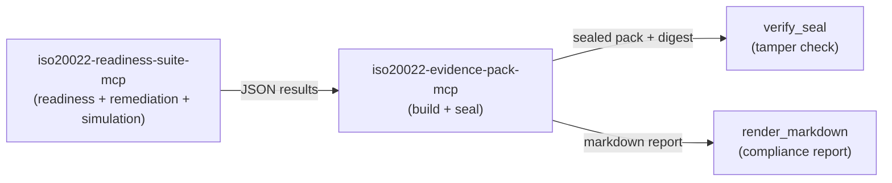

# iso20022-evidence-pack-mcp: Sealed ISO 20022 Audit Evidence Packs

[![PyPI Version][pypi-badge]][07]
[![Python Versions][python-versions-badge]][07]
[![License][license-badge]][01]
[![Tests][tests-badge]][tests-url]
[![Quality][quality-badge]][quality-url]
[![OpenSSF Scorecard][scorecard-badge]][scorecard-url]
[![Documentation][docs-badge]][docs-url]

**A fully local, closed-world [Model Context Protocol (MCP)][mcp] server** that
compiles ISO 20022 readiness findings, remediation diffs, and simulated bank
responses into one **sealed, exportable audit evidence pack**. It is the audit
and certification sibling of
[`iso20022-readiness-suite-mcp`](https://github.com/sebastienrousseau/iso20022-readiness-suite-mcp)
(which produces those findings) and
[`iso20022-bank-profile-mcp`](https://github.com/sebastienrousseau/iso20022-bank-profile-mcp)
in the [ISO 20022 MCP Suite](#the-iso-20022-mcp-suite).

> **Tamper-evident by construction.** The pack's seal is a deterministic
> SHA-256 digest over the pack's canonical JSON (the `digest` field excluded).
> Re-sealing identical content yields the identical digest, and changing any
> field breaks verification — so an auditor can detect undetected change. There
> is **no network surface, no sub-servers, and no XML**: every tool is a pure,
> local, deterministic transform over the JSON structures it is handed.
> **v0.0.1**, stdio transport, 4 tools, Python 3.10+.

## Contents

- [Overview](#overview)
- [The ISO 20022 MCP Suite](#the-iso-20022-mcp-suite)
- [Install](#install)
- [Quick Start](#quick-start)
- [Tools](#tools)
- [Examples](#examples)
- [How it fits the suite](#how-it-fits-the-suite)
- [Open-core vs premium](#open-core-vs-premium)
- [Seal vs signature](#seal-vs-signature)
- [When not to use iso20022-evidence-pack-mcp](#when-not-to-use-iso20022-evidence-pack-mcp)
- [Development](#development)
- [Security](#security)
- [Documentation](#documentation)
- [License](#license)
- [Contributing](#contributing)
- [Acknowledgements](#acknowledgements)

## Overview

The [Model Context Protocol][mcp] (MCP) is an open standard that lets AI agents
and assistants discover and call external tools in a uniform way.
**iso20022-evidence-pack-mcp** is the audit/certification end of the ISO 20022
MCP Suite: it takes the results that
[`iso20022-readiness-suite-mcp`](https://github.com/sebastienrousseau/iso20022-readiness-suite-mcp)
produces — a readiness score with findings, an optional remediation result,
and any simulated bank responses — and folds them into one strongly-typed,
graded, **sealed** evidence pack that can be exported, verified, and rendered
as a compliance report.

An `EvidencePack` folds three loosely-typed inputs into one self-describing
document: a **readiness result** (message type, validity, score, findings), an
optional **remediation result** (fixes applied, residual findings), and any
**simulated bank responses** (accepted / rejected statuses). The pack is graded
(A / B / C / F from the readiness score) and sealed.

The seal is the point: it is a deterministic SHA-256 digest computed over the
pack's canonical JSON form (sorted keys, tight separators, with the `digest`
field itself excluded). Sealing the same content always yields the same value,
which is exactly what makes the pack **tamper-evident** — recomputing the seal
and comparing it to the one carried in the pack tells an auditor whether any
byte changed since it was sealed.

Every tool returns typed, JSON-serialisable data; on any failure — bad input,
unparseable JSON, a shape that does not match the pack schema — it returns an
`{"error": ...}` payload rather than raising into the client transport.

- **Website:** <https://sebastienrousseau.github.io/iso20022-evidence-pack-mcp/>
- **Source code:** <https://github.com/sebastienrousseau/iso20022-evidence-pack-mcp>
- **Bug reports:** <https://github.com/sebastienrousseau/iso20022-evidence-pack-mcp/issues>



The server is fully local and closed-world: it holds no state, opens no
sockets, and spawns no processes. You hand it JSON, it hands you a sealed pack.

## The ISO 20022 MCP Suite

`iso20022-evidence-pack-mcp` is the **audit and certification** server of a set
of coordinated, vendor-neutral MCP servers for the ISO 20022 migration.
Dependency ranges are kept aligned across the suite, so the servers co-install
cleanly in a single Python environment.

| Server | Scope | Install |
|------|------|------|
| [`iso20022-readiness-suite-mcp`](https://github.com/sebastienrousseau/iso20022-readiness-suite-mcp) | Orchestration gateway: readiness scoring, remediation, clearing-profile linting, and bank-response simulation — the results this server folds in | `pip install iso20022-readiness-suite-mcp` |
| [`iso20022-bank-profile-mcp`](https://github.com/sebastienrousseau/iso20022-bank-profile-mcp) | Manage and serve bank-specific clearing profiles / rule packs as a first-class server | `pip install iso20022-bank-profile-mcp` |
| [`structured-address-fix-mcp`](https://github.com/sebastienrousseau/structured-address-fix-mcp) | ISO 20022 postal-address classification, assessment, and remediation for the Nov 2026 structured-address cliff | `pip install structured-address-fix-mcp` |
| [`iso20022-mcp`](https://github.com/sebastienrousseau/iso20022-mcp) | Unified gateway meta-tools (`search` / `describe` / `validate` / `generate` / `parse`) across the ISO 20022 message catalogue | `pip install iso20022-mcp` |
| [`camt053-mcp`](https://github.com/sebastienrousseau/camt053-mcp) | ISO 20022 camt.05x bank statements: parse, validate, filter, reverse; MT94x migration; CBPR+ readiness | `pip install camt053-mcp` |
| [`pain001-mcp`](https://github.com/sebastienrousseau/pain001-mcp) | Generate & validate ISO 20022 pain.001 payment-initiation files (v03–v12, pain.008, SEPA) with rulebook checks | `pip install pain001-mcp` |
| [`reconcile-mcp`](https://github.com/sebastienrousseau/reconcile-mcp) | Reconcile ISO 20022 payments and statements; match initiations to their bank-side outcomes | `pip install reconcile-mcp` |
| [`bankstatementparser-mcp`](https://github.com/sebastienrousseau/bankstatementparser-mcp) | Parse bank statements (MT940/MT942 and camt) into structured, agent-friendly data | `pip install bankstatementparser-mcp` |

Where the readiness suite decides *whether a payment is ready and fixes it*,
**this server certifies the outcome**: it turns those findings into a sealed,
auditable artifact.

## Install

**iso20022-evidence-pack-mcp** runs on macOS, Linux, and Windows and requires
**Python 3.10+** and **pip**. It pulls in only the MCP SDK and `pydantic`
automatically — there are no other runtime dependencies.

```sh
python -m pip install iso20022-evidence-pack-mcp
```

<details>
<summary>Using an isolated virtual environment (recommended)</summary>

```sh
python -m venv venv
source venv/bin/activate        # macOS/Linux
venv\Scripts\activate           # Windows
python -m pip install -U iso20022-evidence-pack-mcp
```
</details>

## Quick Start

For the 10-minute install → MCP client config → first conversation tutorial,
see [`docs/quickstart.md`](docs/quickstart.md).

Launch the server over stdio (the FastMCP default transport):

```sh
iso20022-evidence-pack-mcp
```

Register it with any MCP client (e.g. Claude Desktop) by adding it to the
client's configuration:

```json
{
  "mcpServers": {
    "iso20022-evidence-pack": { "command": "iso20022-evidence-pack-mcp" }
  }
}
```

The command speaks MCP on stdin/stdout — it is meant to be launched by an MCP
client, not used interactively. The agent can then call the tools below.

You can also invoke the tools in-process — without a transport — straight
through the FastMCP instance. This mirrors what an agent receives over stdio.
The example below builds a sealed pack from a small readiness result, then
shows the seal round-tripping (and breaking on tamper):

```python
import asyncio
import json

from iso20022_evidence_pack_mcp import server


async def main() -> None:
    async def call(name, args):
        result = await server.server.call_tool(name, args)
        content = result[0] if isinstance(result, tuple) else result
        return content[0].text if content else ""

    readiness = json.dumps({
        "message_type": "pacs.008.001.08",
        "is_valid": True,
        "readiness_score": 92,
        "structural_errors": [],
        "profile_findings": [],
    })

    # Fold the readiness result into a graded, sealed evidence pack.
    built = json.loads(await call("build_evidence_pack",
                                  {"readiness_content": readiness}))
    pack, digest = built["pack"], built["digest"]
    print(pack["grade"], digest)      # -> A sha256:01388e3dfbea7d21...

    # The seal round-trips: re-verifying the pack against its digest holds.
    ok = json.loads(await call("verify_seal", {
        "pack_content": json.dumps(pack),
        "expected_digest": digest,
    }))
    print(ok["verified"])             # -> True

    # Change any field and verification against the old digest fails.
    tampered = {**pack, "grade": "F"}
    bad = json.loads(await call("verify_seal", {
        "pack_content": json.dumps(tampered),
        "expected_digest": digest,
    }))
    print(bad["verified"])            # -> False


asyncio.run(main())
```

## Tools

All tools are read-only, local, idempotent, and closed-world. They return
JSON-serialisable data; on a validation or shape error they return an
`{"error": ...}` payload rather than raising.

- `build_evidence_pack` — Fold a readiness result (plus an optional remediation result, optional simulated bank responses, and free-form metadata) into a graded, sealed evidence pack; returns the pack, its digest, and a rendered markdown report.
- `seal_pack` — Compute the deterministic SHA-256 seal for an evidence pack (raw JSON).
- `verify_seal` — Recompute a pack's seal and compare it to an expected digest.
- `render_markdown` — Render an evidence pack as a markdown compliance report.

## Examples

Runnable, self-contained examples live in [`examples/`](examples/). Each script
drives the public tools directly and needs no network or sub-server:

```sh
python examples/01_build_full_pack.py
```

See [`examples/README.md`](examples/README.md) for the full catalogue, or run
them all with `make examples`.

## How it fits the suite

The readiness suite and the evidence-pack server form a two-stage pipeline:

1. **Readiness → results.**
   [`iso20022-readiness-suite-mcp`](https://github.com/sebastienrousseau/iso20022-readiness-suite-mcp)
   runs `run_readiness_check` (score + findings), `remediate_payload`
   (automated fixes), and `simulate_bank_response` (a mocked pacs.002 outcome).
   Each returns typed JSON.
2. **Results → sealed pack.** You hand those JSON results to
   `build_evidence_pack` here. It normalises them into a strongly-typed pack,
   grades the readiness score (A/B/C/F), and seals the whole thing with a
   deterministic SHA-256 digest. `verify_seal` later proves the pack is
   unchanged; `render_markdown` turns it into a human-readable compliance
   report.

Because the seal is deterministic, the same inputs always produce the same
digest — so a pack built today and re-sealed next quarter is provably the same
pack, or provably not. The two servers stay decoupled: the readiness suite
knows nothing about sealing, and this server knows nothing about how the
findings were produced — it only folds and certifies them.

## Open-core vs premium

The server is **open core**: building, sealing, verifying, and rendering packs
are open source and always available. Higher-tier capabilities that turn a
tamper-evident pack into an *authenticatable*, durably archived artifact are
commercial add-ons on the [roadmap](ROADMAP.md).

| Capability | Tier |
|---|---|
| Pack assembly + grading (`build_evidence_pack`) | **Open Source** |
| Deterministic SHA-256 sealing + verification (`seal_pack`, `verify_seal`) | **Open Source** |
| Markdown compliance reports (`render_markdown`) | **Open Source** |
| Cryptographic signing (keys / PKI, authenticity) | **Paid / Roadmap** |
| Long-term evidence storage + export formats (PDF/A, WORM archives) | **Paid / Roadmap** |
| White-label reports + premium entitlement gating | **Paid / Roadmap** |

Nothing in the open-source tier is time-limited or feature-gated: the seal and
the reports are fully functional today.

## Seal vs signature

**The seal is an integrity digest, not a cryptographic signature.** It proves
that a pack has not changed since it was sealed (tamper-evidence); it does
**not** prove *who* produced the pack (authenticity). Anyone who can build a
pack can also compute a valid seal for it, so a seal is a checksum, not a
proof of origin.

Establishing authenticity — binding a pack to an operator identity via keys /
PKI — is explicitly a **roadmap** item (see [`ROADMAP.md`](ROADMAP.md)) and,
until it ships, the operator's responsibility. Treat a sealed pack as
integrity-checked, transmit and store it over channels you already trust, and
do not represent it as a signed one. See [`SECURITY.md`](SECURITY.md) for the
full threat-model note.

## When not to use iso20022-evidence-pack-mcp

- **You have no MCP client.** This server only makes sense paired with an
  MCP-aware host (Claude Desktop, the IDE plugins, an agent framework).
- **You need the readiness findings themselves.** This server *certifies*
  results; it does not produce them. Run
  [`iso20022-readiness-suite-mcp`](https://github.com/sebastienrousseau/iso20022-readiness-suite-mcp)
  to score, remediate, and simulate first, then fold its output in here.
- **You need a cryptographic signature / proof of origin.** The seal is a
  tamper-evidence digest, not a signature (see
  [Seal vs signature](#seal-vs-signature)). Signing is on the roadmap.
- **You need a long-lived network service.** v0.0.1 speaks **stdio only** —
  one process per operator, launched by the client, no network surface. An
  HTTP/OAuth transport for shared, multi-tenant deployments is on the
  [roadmap](ROADMAP.md), not in this release.
- **You need streaming responses.** Tool calls return whole values, not
  streams.

## Development

**iso20022-evidence-pack-mcp** uses [Poetry](https://python-poetry.org/) and
[mise](https://mise.jdx.dev/).

```bash
git clone https://github.com/sebastienrousseau/iso20022-evidence-pack-mcp.git && cd iso20022-evidence-pack-mcp
mise install
poetry install
poetry shell
```

A `Makefile` orchestrates the quality gates (kept in lockstep with CI):

```bash
make check        # all gates (REQUIRED before commit): lint + type-check + test
make test         # pytest (100% line + branch coverage)
make lint         # ruff + black
make type-check   # mypy --strict
make security     # bandit
make examples     # run every examples/*.py end to end
```

## Security

`iso20022-evidence-pack-mcp` returns errors as data — every tool catches the
documented validation and value errors and returns an `{"error": ...}`
envelope; it never propagates raw exceptions to the MCP client. The server has
no network surface, spawns no sub-processes, and parses no XML — its whole
attacker-reachable surface is JSON parsed with the standard library and
validated against pydantic models. **The pack seal is a tamper-evidence digest,
not a signature** (see [Seal vs signature](#seal-vs-signature)). Reporting
practice, supported versions, the seal threat-model note, and the full
supply-chain posture (SLSA L3 provenance, PEP 740 attestations, SBOMs, and the
NIST SP 800-218 SSDF practice mapping) are documented in
[`SECURITY.md`](SECURITY.md). Vulnerabilities go via GitHub Private
Vulnerability Reporting, not public issues.

## Documentation

- [`README.md`](README.md) — this file
- [`CHANGELOG.md`](CHANGELOG.md) — release notes
- [`SECURITY.md`](SECURITY.md) — disclosure + supported versions + seal threat model
- [`SUPPORT.md`](SUPPORT.md) — how to get help
- [`ROADMAP.md`](ROADMAP.md) — what's next (cryptographic signing, long-term storage, HTTP transport, premium entitlement)
- [`MAINTAINERS.md`](MAINTAINERS.md) — who can merge
- [`docs/quickstart.md`](docs/quickstart.md) — 10-minute install → first conversation
- [`docs/evidence-packs.md`](docs/evidence-packs.md) — the pack schema, the SHA-256 sealing model, and the readiness → evidence pipeline
- [`glama.json`](glama.json) — Glama directory manifest

---

## MCP Registry

`mcp-name: io.github.sebastienrousseau/iso20022-evidence-pack-mcp`

---

## License

Licensed under the [Apache License, Version 2.0][01]. Any contribution submitted
for inclusion shall be licensed as above, without additional terms.

## Contributing

Contributions are welcome — see the [contributing instructions][04]. Thanks to
all [contributors][05].

## Acknowledgements

Built alongside the servers of the ISO 20022 MCP Suite and the
[Model Context Protocol][mcp] Python SDK.

[01]: https://opensource.org/license/apache-2-0/
[04]: https://github.com/sebastienrousseau/iso20022-evidence-pack-mcp/blob/main/CONTRIBUTING.md
[05]: https://github.com/sebastienrousseau/iso20022-evidence-pack-mcp/graphs/contributors
[07]: https://pypi.org/project/iso20022-evidence-pack-mcp/
[mcp]: https://modelcontextprotocol.io
[docs-badge]: https://img.shields.io/badge/Docs-iso20022--evidence--pack-blue?style=for-the-badge
[docs-url]: https://sebastienrousseau.github.io/iso20022-evidence-pack-mcp/
[license-badge]: https://img.shields.io/pypi/l/iso20022-evidence-pack-mcp?style=for-the-badge
[pypi-badge]: https://img.shields.io/pypi/v/iso20022-evidence-pack-mcp?style=for-the-badge
[python-versions-badge]: https://img.shields.io/pypi/pyversions/iso20022-evidence-pack-mcp.svg?style=for-the-badge
[quality-badge]: https://img.shields.io/github/actions/workflow/status/sebastienrousseau/iso20022-evidence-pack-mcp/ci.yml?branch=main&label=Quality&style=for-the-badge
[quality-url]: https://github.com/sebastienrousseau/iso20022-evidence-pack-mcp/actions/workflows/ci.yml
[scorecard-badge]: https://api.scorecard.dev/projects/github.com/sebastienrousseau/iso20022-evidence-pack-mcp/badge?style=for-the-badge
[scorecard-url]: https://scorecard.dev/viewer/?uri=github.com/sebastienrousseau/iso20022-evidence-pack-mcp
[tests-badge]: https://img.shields.io/github/actions/workflow/status/sebastienrousseau/iso20022-evidence-pack-mcp/ci.yml?branch=main&label=Tests&style=for-the-badge
[tests-url]: https://github.com/sebastienrousseau/iso20022-evidence-pack-mcp/actions/workflows/ci.yml
